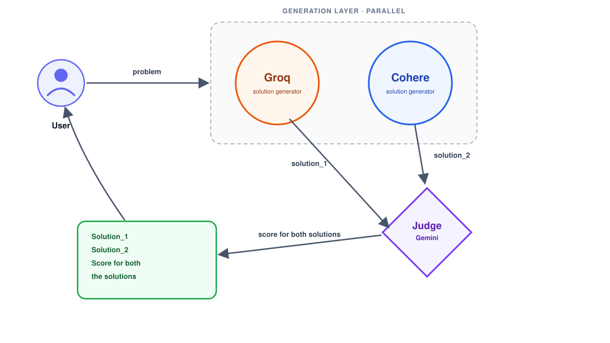

# AI Battle Arena

A comparative evaluation system that routes a single user prompt to two independent large language models, then uses a third model as an impartial judge to score and rank the responses.

Instead of relying on one model's output, the system surfaces both answers side by side along with an objective quality assessment, allowing the user to see not just what each model produced, but how the two compare on correctness, completeness, and clarity.

---

## Table of Contents

- [Overview](#overview)
- [Architecture](#architecture)
- [How It Works](#how-it-works)
- [Tech Stack](#tech-stack)
- [Getting Started](#getting-started)
- [Environment Variables](#environment-variables)
- [API Reference](#api-reference)
- [Project Structure](#project-structure)
- [Evaluation Criteria](#evaluation-criteria)
- [Limitations](#limitations)
- [Roadmap](#roadmap)
- [License](#license)

---

## Overview

Single-model applications give you one answer with no frame of reference for its quality. This project addresses that by running the same problem through two different model providers in parallel and introducing an LLM-as-a-judge layer that evaluates both outputs against a fixed rubric.

The result is a three-part response: solution one, solution two, and a structured score explaining which performed better and why.

**Key characteristics:**

- **Parallel generation** — both models are queried concurrently, so total latency is bounded by the slower of the two rather than their sum.
- **Independent evaluation** — the judge receives both solutions without knowing which model produced which, reducing provider bias in scoring.
- **Structured scoring** — the judge returns machine-readable JSON, making results consistent and easy to render or store.
- **Provider-agnostic design** — the generation layer is abstracted, so additional models can be added without changing the judging logic.

---

## Architecture



The system has three distinct layers:

| Layer | Responsibility |
| --- | --- |
| **Generation** | Dispatches the user's problem to Groq and Cohere concurrently and collects both raw solutions. |
| **Judging** | Passes both solutions to Gemini, acting as an independent judge, with a scoring rubric and returns a structured verdict. |
| **Presentation** | Renders both solutions alongside the judge's scores and reasoning for the user. |

---

## How It Works

**1. Problem submission**

The user submits a problem statement through the client. The request is validated and forwarded to the generation layer.

**2. Parallel generation**

The problem is dispatched simultaneously to both providers. Because the two calls are independent, they are issued concurrently rather than sequentially:

```js
const [solutionOne, solutionTwo] = await Promise.all([
  generateWithGroq(problem),
  generateWithCohere(problem)
]);
```

If one provider fails or times out, the system degrades gracefully by reporting the failure for that model rather than aborting the entire request.

**3. Judging**

Both solutions are passed to Gemini in a single prompt containing the original problem, the two candidate solutions, and an explicit scoring rubric. Gemini acts purely as an evaluator here — it does not generate a competing solution of its own — which keeps it neutral with respect to the two providers it is judging. It is instructed to return strict JSON so the output can be parsed reliably:

```json
{
  "solution_1": { "score": 8.5, "strengths": "...", "weaknesses": "..." },
  "solution_2": { "score": 7.0, "strengths": "...", "weaknesses": "..." },
  "winner": "solution_1",
  "reasoning": "..."
}
```

**4. Response assembly**

The API returns both solutions and the judge's verdict as a single payload. The client renders them side by side with the scores attached.

---

## Tech Stack

| Category | Technology |
| --- | --- |
| Frontend | React, Vite |
| Backend | Node.js, Express |
| Model Provider A | Groq |
| Model Provider B | Cohere |
| Judge Model | Google Gemini |
| HTTP Client | Axios |
| Environment Config | dotenv |

> Replace the judge row and add any additional libraries (database, styling framework, state management) that your implementation uses.

---

## Getting Started

### Prerequisites

- Node.js 18 or higher
- A Groq API key
- A Cohere API key
- A Google Gemini API key

### Installation

Clone the repository:

```bash
git clone https://github.com/your-username/your-repo.git
cd your-repo
```

Install backend dependencies:

```bash
cd backend
npm install
```

Install frontend dependencies:

```bash
cd ../frontend
npm install
```

### Running Locally

Start the backend:

```bash
cd backend
npm run dev
```

Start the frontend in a separate terminal:

```bash
cd frontend
npm run dev
```

The client runs on `http://localhost:5173` and the API on `http://localhost:3000` by default.

---

## Environment Variables

Create a `.env` file in the backend directory:

```env
PORT=3000
GROQ_API_KEY=your_groq_api_key
COHERE_API_KEY=your_cohere_api_key
GEMINI_API_KEY=your_gemini_api_key
```

Never commit `.env` to version control. Add it to `.gitignore` and provide a `.env.example` with empty values for other contributors.

---

## API Reference

### `POST /api/compare`

Submits a problem for dual generation and judging.

**Request body**

```json
{
  "problem": "Explain the difference between processes and threads."
}
```

**Response**

```json
{
  "solution_1": {
    "model": "groq",
    "content": "..."
  },
  "solution_2": {
    "model": "cohere",
    "content": "..."
  },
  "evaluation": {
    "solution_1": { "score": 8.5, "strengths": "...", "weaknesses": "..." },
    "solution_2": { "score": 7.0, "strengths": "...", "weaknesses": "..." },
    "winner": "solution_1",
    "reasoning": "..."
  }
}
```

**Status codes**

| Code | Meaning |
| --- | --- |
| `200` | Both solutions generated and scored successfully |
| `400` | Missing or invalid problem statement |
| `502` | One or both upstream providers failed |
| `500` | Internal server error |

---

## Project Structure

```
.
├── backend
│   ├── src
│   │   ├── controllers      # Request handlers
│   │   ├── services         # Groq, Cohere, and Gemini (judge) integrations
│   │   ├── routes           # API route definitions
│   │   └── app.js           # Express application setup
│   ├── server.js            # Entry point
│   └── .env
└── frontend
    ├── src
    │   ├── components       # UI components
    │   ├── pages            # Views
    │   └── services         # API client
    └── vite.config.js
```

Adjust this tree to match your actual directory layout.

---

## Evaluation Criteria

The judge model scores each solution on the following dimensions:

| Criterion | Description |
| --- | --- |
| **Correctness** | Is the information factually accurate and free of errors? |
| **Completeness** | Does the response fully address every part of the problem? |
| **Clarity** | Is the explanation well structured and easy to follow? |
| **Conciseness** | Does it avoid unnecessary padding while remaining thorough? |

Scores are returned on a scale of 1 to 10 per solution, accompanied by written reasoning and an overall winner.

---

## Limitations

- **Judge bias.** An LLM acting as an evaluator carries its own biases. Scores should be treated as directional signals rather than ground truth.
- **Non-determinism.** Model outputs vary between runs, so the same problem may produce different solutions and different scores.
- **Rate limits.** Both providers enforce request quotas. Sustained or high-volume usage requires request throttling or caching.
- **Cost and latency.** Every request consumes three model calls, which increases both cost and response time relative to a single-model approach.

---

## Roadmap

- Support for more than two models in a single comparison
- Persistence layer for storing comparison history
- Streaming responses to reduce perceived latency
- Aggregate leaderboard tracking model performance over time
- Configurable rubrics so users can define their own scoring criteria

---

## License

Distributed under the MIT License. See `LICENSE` for details.
